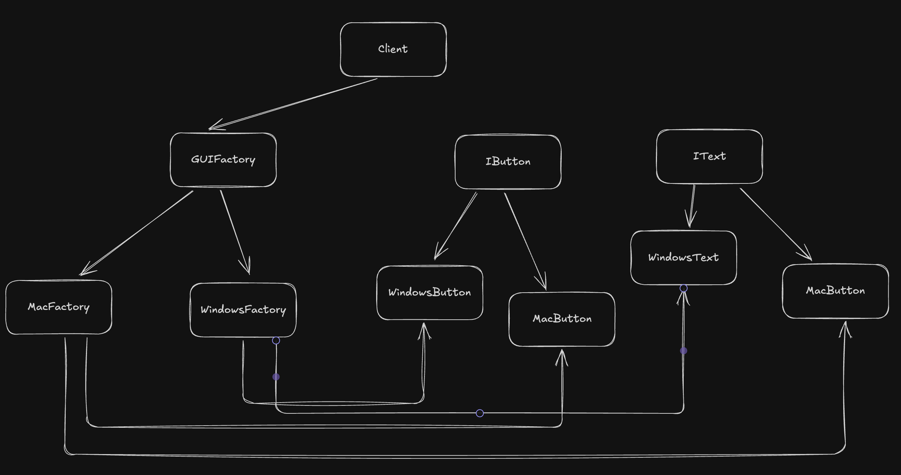

## Abstract Factory Design Pattern Overview

The **Abstract Factory Design Pattern** is also a creational design pattern, but it introduces an additional layer of abstraction compared to the Factory Design Pattern. Its core function is to **create factories** that, in turn, create a "family of classes" or related objects.

### How it Differs and Works:
-   **Factory of Factories**: While a regular factory creates concrete objects, an abstract factory creates different *factories*.
-   **Family of Products**: It's used when you need to create families of related or dependent objects without specifying their concrete classes.
-   **Layered Creation**:
    1.  The client first interacts with an **Abstract Factory** (e.g., `GUIAbstractFactory`) and specifies a high-level type (e.g., OS type like Windows or Mac).
    2.  The Abstract Factory then returns a **concrete factory** (e.g., `MacFactory` or `WindowsFactory`) based on the specified type.
    3.  This concrete factory is then used by the client to create specific objects (e.g., `MacButton` or `WindowsButton`) belonging to that family.
-   **Client Simplification**: The client remains decoupled from the specific implementation details of object creation, only needing to know which factory to request initially. Changes or additions (like new OS types or components) are confined to the factory hierarchy, not the client code.

---

## Abstract Factory Diagram: GUI Components Example

Here is a flowchart illustrating how the Abstract Factory pattern works for creating GUI components like buttons and text boxes across different operating systems (OS), as explained in the video.

- This structure allows the client to request a button or text box without needing to know if it's a Mac or Windows specific component; that decision is handled by the appropriate factory created by the `GUIAbstractFactory`.

