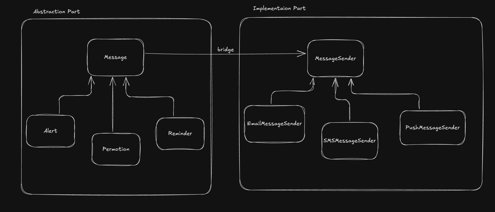

## 🌉 Bridge Design Pattern – Simple Notes

### ✅ What is Bridge Pattern?

> The **Bridge Design Pattern** is a structural pattern that **decouples an abstraction from its implementation**, so that both can evolve **independently**.

---

## 🧩 Real-World Style Problem

### 📦 Scenario: Cross-Platform Notification System

You’re building a **notification feature** for your app.
You support:

* **Different types of messages**: `Alert`, `Reminder`, `Promotion`
* **Different channels** to send them: `Email`, `SMS`, `Push Notification`

---

### ❌ Without Bridge (Tightly Coupled Design)

You might do something like this:

```ts
class EmailAlert { send() { /* ... */ } }
class SMSAlert { send() { /* ... */ } }
class EmailReminder { send() { /* ... */ } }
class SMSReminder { send() { /* ... */ } }
class PushPromotion { send() { /* ... */ } }
// And so on...
```

### 😵 Problem:

* Adding a **new channel** means updating **every message type**
* Adding a **new message type** means creating one for **each channel**
* You end up with a **combinatorial explosion** of classes

---

## 🔧 Solution: Use **Bridge Pattern**

Separate:

* **Abstraction** → The message type (Alert, Reminder, etc.)
* **Implementation** → The channel (Email, SMS, etc.)

Now they can grow **independently**.

---

### 🧱 Structure

```ts
// IMPLEMENTATION LAYER (Channel)
interface MessageSender {
  sendMessage(message: string): void;
}

class EmailSender implements MessageSender { ... }
class SMSSender implements MessageSender { ... }

// ABSTRACTION LAYER (Message)
abstract class Message {
  constructor(protected sender: MessageSender) {}
  abstract send(content: string): void;
}

class Alert extends Message {
  send(content: string) {
    this.sender.sendMessage("[ALERT] " + content);
  }
}
```

Now you can do:

```ts
const sender = new EmailSender();
const alert = new Alert(sender);
alert.send("Server is down!");
```

---

## 🔗 How It Decouples Abstraction from Implementation

| Layer              | What it does                               | Can it change independently? |
| ------------------ | ------------------------------------------ | ---------------------------- |
| **Abstraction**    | Defines message behavior                   | ✅ Yes                        |
| **Implementation** | Handles how messages are sent (email, SMS) | ✅ Yes                        |

You can:

* Add a new message type (`Promotion`, `Warning`, etc.) ✅
* Add a new channel (`WhatsAppSender`, `InAppSender`) ✅
  Without changing each other.

---

## 🖼️ Diagram – Problem Without Bridge

```plaintext
        Alert           Reminder         Promotion
          |                 |                 |
        Email             Email             Email
        SMS               SMS               SMS
        Push              Push              Push

Each combination = a new class 😫
```

---

## 🖼️ Diagram – With Bridge Pattern



---

### ✅ Benefits You Just Got

* You can add new **message types** (like `Newsletter`) without touching the sender classes.
* You can add new **senders** (like `WhatsAppSender`, `InAppSender`) without changing the message classes.
* Clean, extendable, and easy to maintain 🔥


