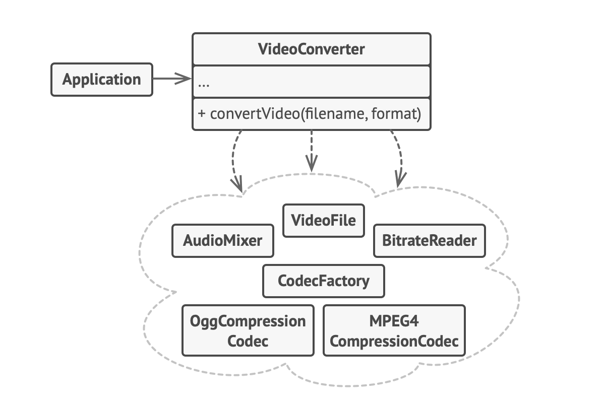

## 🎭 Facade Design Pattern – Notes

### ✅ What is Facade Design Pattern?

> The Facade Design Pattern provides a **simple interface** to a **complex system of classes, APIs, or subsystems**.
> It hides the complexity from the user and **exposes only what is necessary**.

---

### 🎯 Why use it?

* To **simplify** how the client interacts with a complicated system
* To provide a **clean, readable API**
* To **reduce coupling** between the client and many internal parts

---

### 💡 Real-Life Analogy:

When you **turn on a TV** with a remote, you don’t deal with the circuits, sound system, or input switching.
The **remote** is the **facade** that gives you an easy interface to all that.

---

### 🧱 Key Point:

* The **Facade class** is not adding new behavior — it's just **organizing multiple parts** and exposing a **simplified method** for the client to use.

---

## 🧩 Components in Simple Terms

| Component      | Meaning in Simple Terms                                          |
| -------------- | ---------------------------------------------------------------- |
| **Facade**     | A single class that wraps and hides complex parts                |
| **Subsystems** | The internal classes or modules doing the actual work            |
| **Client**     | The code using the Facade instead of calling subsystems directly |

---

## Example:

### Video Conversion
