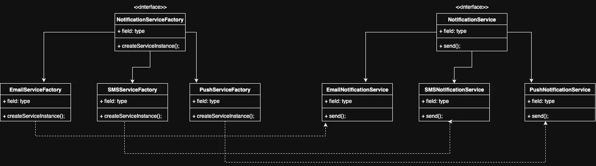
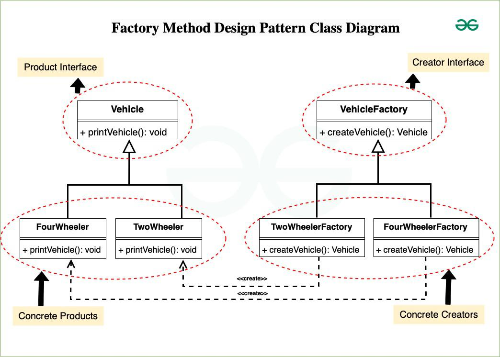

## 🏭 Factory Design Pattern – Notes

### ✅ What is Factory Design Pattern?

> The Factory Design Pattern is a **creational pattern** that provides a way to **create objects without exposing the creation logic** to the client.
> Instead of using `new` directly, the client asks a **factory method** to return the right object based on some input.

---

### 🎯 Why use it?

* To **avoid hardcoding object creation** in the client
* To make your code **easier to extend** (Open/Closed Principle)
* To **decouple** the object creation from usage

---

### 🔧 Example (Notification System):

```ts
const notification = NotificationFactory.getNotification("sms");
notification.send("Hello!");
```

Here, the client doesn't know or care how the SMS object is created — it just works.

---

### 🧱 Components of Factory Pattern (Simplified):

| Component            | Meaning in Simple Terms                     | Example in Notification System         |
| -------------------- | ------------------------------------------- | -------------------------------------- |
| **Creator**          | Has the factory method that creates objects | `NotificationFactory`                  |
| **Concrete Creator** | Implements the creation logic               | `EmailNotificationFactory` (static method)  |
| **Product**          | Common interface for all products           | `Notification` interface               |
| **Concrete Product** | Actual objects returned by the factory      | `EmailNotification`, `SMSNotification` |

---

### Example Diagrams:

#### Notification System


#### Vehicle Type Instance
